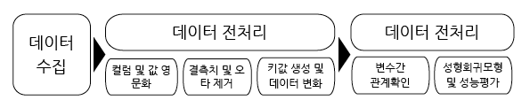

# EDA_project(데이터 전처리 및 기술 분석)

## 1. 주제

- 본 프로젝트의 목적은 아파트 분양가격과 관련이 높을것으로 판단되는 데이터를 수집하여 분양가격을 예측할 수 있는 모형을 제안하는 것에 있다.

- 본 프로젝트는 FAST CAMPUS "데이터 사이언스 취업완성 SCHOOL" 의 **박두진 강사님** 지도하에 **최태병, 문다영, 손형진**이 팀을 이루어 진행하였다.

## 2. 연구문제

- 금리, 소비자물가지수, 산업생산지수, 부동산 정책, 주택정책 검색량, 아파트 사이즈를 바탕으로 최적의 분양가격을 예측할 수 있는 회귀모델을 제안한다.

## 3. 연구방법

아래 그림은 본 프로젝트의 데이터 분석 과정을 보여준다.

## 4. 데이터 수집

### 4.1 데이터 수집 근거

- 임대봉(2007)의 논문 "주택가격 상승요인과 대책방안"을 바탕으로 주택가격가 관계가 강할 것으로 예측되는 금리, 소비자물가지수, 산업생산지수, 주택정책을 강사님이 제안한 데이터에 추가하였다. 단, 주택정책의 경우 주택정책이 발표되는 시기에 "주택정책"이라는 검색이 많아 질 것으로 가정하여 구글 트랜드 데이터로 대체하였다. 아래 그림은 임대봉(2007)이 제안한 주택가격에 영향을 주는 독립변수별 오차수정모형 추정결과를 보여준다.

### 4.2 데이터 소개

#### 과제 데이터

- house : 전국 평균 분양가격(2019년 9월)(출처 : [공공데이터 포탈(DATA)](https://www.data.go.kr/dataset/3035522/fileData.do))
  
#### 추가 데이터

- cofix : 금리  (출처 : [은행연합회소비자포탈](https://portal.kfb.or.kr/fingoods/cofix.php))
    - 은행들이 기준금리에 자금 조달 비용을 반영해 산출하는 주택담보대출 금리
- cpi : 소비자물가지수(출처 : [국가통계포탈(KOSIS)](http://kosis.kr/statHtml/statHtml.do?orgId=101&tblId=DT_1J17002&conn_path=I2))
    - 일반 도시 가계가 소비생활을 영위하기 위하여 구입하는 소비재와 서비스의 가격변동을 나타내는 지수
    - 2017년 = 100
- iaip : 산업생산지수  (출처 : [이나라지표](http://www.index.go.kr/potal/main/EachDtlPageDetail.do?idx_cd=2838))
    - 우리나라 경제전체의 모든 산업을 대상으로 재화와 용역에 대한 생산활동의 흐름과 변화를 월별지수로 나타낸 것
    - 2015 년 = 100
- googletrend : 구글 "주택정책" 검색 비율 (출처 : [구글트렌드](https://trends.google.co.kr/trends/?geo=KR))
    - 주택정책에 대한 이슈를 수치화하기 위한 데이터로 사용
    - 2015년 1월~ 2019년 9월 중 가장 검색을 많이했을때의 검색량 = 100

## 5. 데이터 전처리

### 5.1 데이터 불러오기 및 컬럼, 값 수정

1. 컬럼 및 값 영문화
    - house
        - 컬럼 변경  

         |한글 컬럼|지역명|규모구분|연도 |월    |분양가격|
         |------|-----|------|----|-----|------|
         |영문 컬럼|city|size  |year|month|Price |

        - 규모구분(size) 실수형 자료로 수정  

         |수정 전|전체|전용면적60㎡이하|전용면적 60㎡초과 85㎡이하|전용면적 85㎡초과 102㎡이하|전용면적 102㎡초가|
         |---|---|---|---|---|---|
         |수정 후|total|1|2|3|4|  

    - cofix  

     |한글 컬럼|공시일|신규취급액기준cofix|
     |---------|------|-------------------|
     |영문 컬럼|date  |cofix              |  

    - cpi  

     |한글 컬럼|기간|총지수     |
     |---------|----|-----------|
     |영문 컬럼|date|total_index|  

    - iaip  

     |한글 컬럼|index|전업생산지수(원지수)|
     |---------|-----|--------------------|
     |영문 컬럼|date |origin_index        |  
     
2. 결측치 뿐만 아니라 " ", "-", "," 을 제거한 후 데이터 갯수 확인
    - `missingno` 패키지를 활용한 결측값 확인(house 데이터에서만 결측값 확인)
     
    - 결측치 및 " ", "-", 와 같은 오타 을 제거(종속 변수가 되는 분양가격이 없을 경우 해당 행의 값이 의미 없다고 판단하여 제거하는 방식을 택했다)

### 5.2 키값 생성 및 데이터 병합

- 각 데이터의 날짜 형식을 **"2019-01-01"**과 같이 통일 하고자 한다(해당 데이터의 날짜 형식은 달 단위로 기입 되어 있으나, 차우 datetiem 모듈 사용을 위해 01로 통일된 날 단위를 추가하였다.)

|데이터명   |원 날짜표시형태      |변환 방식                              |코드요약|
|-----------|---------------------|---------------------------------------|--------|
|house      | 연도 : 2019/ 월 : 9 | (연도 X 100) + 월 +01, 데이터 슬라이싱|house_df["year"]*100+house_df["month"] ->house_df["date"].str[0:4] + "-"+house_df["date"].str[4:6]+"-01"|
|cofix      | 2019/05             | replace 함수,데이터 슬라이싱          |cofix_df['date'].str.replace("/", "-") + "-01"|
|cpi        | 2019.01             | 기간 X 100, 데이터 슬라이싱           |cpi_df["date"]*100 -> cpi_df["date"].str[0:4] + "-" + cpi_df["date"].str[4:6] + "-01" |
|iaip       | 201901월            | replace 함수 ,데이터 슬라이싱         |iaip_df['date'].str.replace("월", "").str[0:4] + "-" + iaip_df["date"].str[4:6] + "-01"|
|googletrend| 2019-01-04          | 데이터 슬라이싱                       |googletrend_df['date'].str[0:4] + "-"+ googletrend_df['date'].str[5:7] + "-01"|

## 6. 분석

### 6.1 변수간 관계확인

- 시간에 흐름에 따른 지역별 분양가 변화
 
- 시간에 흐름에 따른 서울지역 분양가 변화
 
- 각 변수간 페어 플랏
 
- 각 변수간 상관계수를 활용한 히트맵
 
- 부분회귀결과
 

### 6.2 선형회귀모형 및 성능평가

선형회귀모형 제안을 위해서 sklearn 패키지를 활용하였고, size, cofix, total_index, origin_index, google을 독립변수로 하고 price를 종속변수로 하는 회귀 모형을 제안하였다. 성능평가를 위해 평균절대대비오차(MAE)와  r-square값을 확인 하였으며 비록 만족 스러운 성능 평가('예측 오차 : ', 627.0, 'R-Square : ', 0.21)를 도출하지 못했지만 본 프로젝트의 초점이 데이터 전처리 및 시각화에 맞춰져 있다는 점을 고려하여 다른 모델 도출을 하지 않았다.
